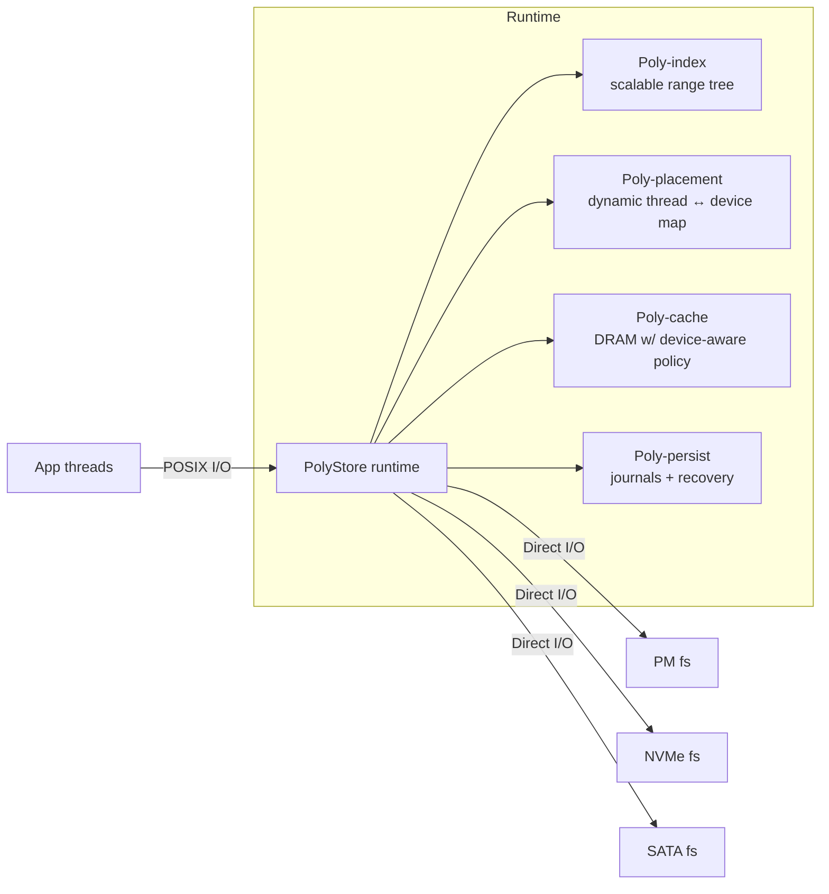
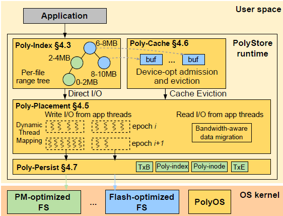
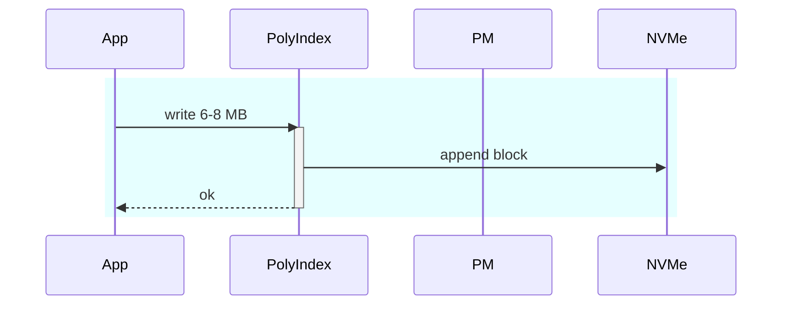
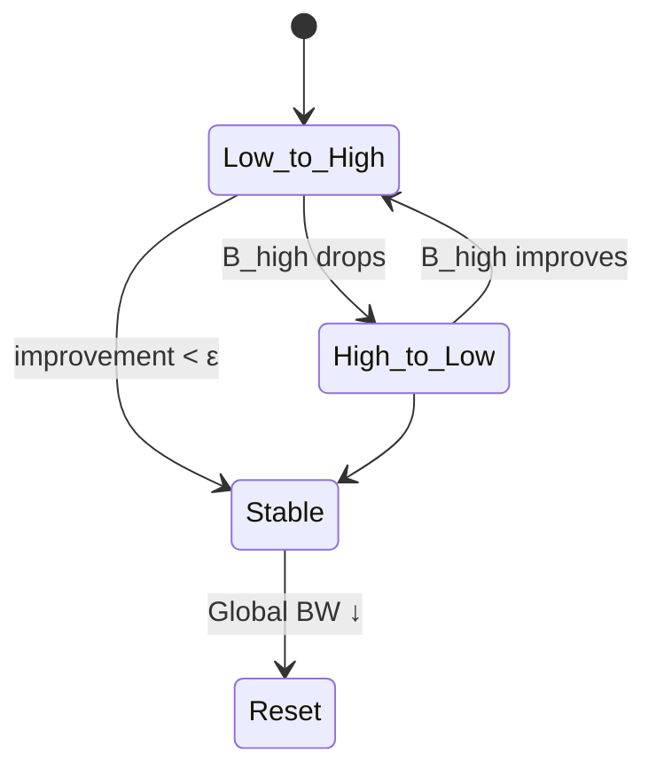
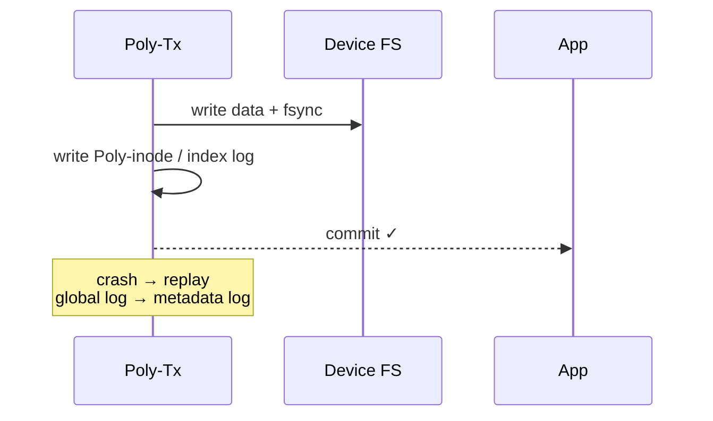

# PolyStore: Exploiting Combined Capabilities of Heterogeneous Storage

## Big picture – PolyStore's "horizontal" take on heterogeneous storage

Traditional caching and tiering stacks shove fast media on top of slow ones; this starves writes, overloads the top tier and wastes the aggregate bandwidth sitting in the rest of the rack. PolyStore flips the layout sideways: one logical file is striped across all devices, then a user-level runtime steers threads, cache lines and commits so the whole gang (PM + NVMe + SATA ...) works together.

## System Architecture

## Scalable data indexing – Poly-index

- What it is: A per-file range-tree (augmented red-black) where each 2 MB node carries its own RW-lock and an optional DRAM-buffer pointer.

- Why it's novel: Lets concurrent readers/writers append or read different ranges on different devices with only fine-grain locks; the tree footprint is 64 MB for a 1 TB file (0.006 %).

- Compared to hierarchy: Caches/tiering keep a single inode and global lock; Poly-index removes that bottleneck and makes "non-hierarchical striping" addressable. 

## Dynamic thread + data placement – Poly-placement

- Monitors per-device throughput every 200 ms epoch → greedily remaps threads to the device that still has headroom; flips direction once contention appears.
- Hot blocks that sit on a now-slower tier are migrated forward (BW_Move) while background CAP_Move pushes cold data back when fast tiers near 90 % full.
- Wins up to 9.3 × over Orthus/Strata by using both read and write bandwidth concurrently.

## Storage-aware DRAM caching – Poly-cache

- Sits in user space, bypasses page cache → fewer traps.
- One unified DRAM pool, but admission/eviction policy differs per device:
    - Bypass reads from super-fast PM.
    - Give bigger slice to slow SATA, shrinking NVMe slice on the fly.
- Two-level LRU (file, then range) flushed by a pool of eviction threads equal to the number of storage types, scaling with available BW.

## Durability & crash consistency – Poly-persist
- Split journal: (a) global log of unfinished ops, (b) per-file metadata log, (c) range-level data log.
- Commits first to the native fs journal, then to PolyStore metadata — giving at least metadata-durable semantics across mismatched file-systems (e.g., NOVA + ext4).
- Range nodes are two cache-lines so PM flushes are atomic; on plain SSDs it uses msync. Recovery replays the logs after the underlying fs mounts.

# Key differences at a glance

| Feature | Hierarchical cache/tier (Orthus/Strata) | PolyStore |
|---------|----------------------------------------|-----------|
| Bandwidth use | Fast-tier saturated first, slow-tier idle | Sharding across all tiers |
| Index granularity | Single-inode, coarse locks | 2 MB range-tree, per-node lock |
| Thread mapping | Static or device-centric | Epoch-based dynamic remap |
| DRAM cache | One-policy fits all | Per-device adaptive policies |
| Durability across fs | Device-specific | Unified journal & recovery |
